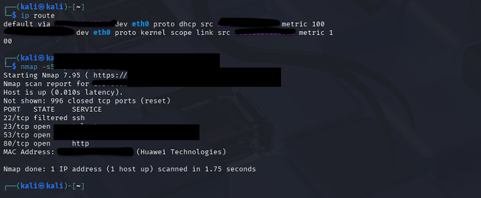
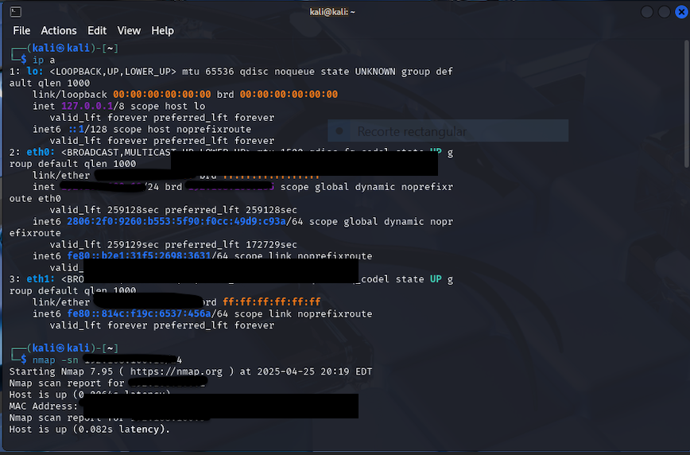

# 🔎 Análisis de Seguridad en Router Doméstico - Abril 2025

## 🛡️ Descripción

Este proyecto documenta el análisis de seguridad realizado sobre mi red doméstica como parte de mi aprendizaje en ciberseguridad. El objetivo fue identificar posibles vulnerabilidades en el router, aprender a utilizar herramientas de reconocimiento de red y documentar los hallazgos de manera profesional.

## 🛠️ Herramientas utilizadas

- Kali Linux (máquina virtual)
- nmap (Network Mapper)
- Comandos básicos de red en Linux (`ip a`, `ip route`)

## 📋 ¿Qué contiene esta carpeta?

| Archivo              | Descripción                                     |
|-----------------------|-------------------------------------------------|
| `reporte.md`          | Reporte técnico con hallazgos, riesgos y recomendaciones. |
| `/evidencias/`        | Capturas de pantalla del proceso (con datos sensibles censurados). |

## 🏁 Objetivo del análisis

- Aprender a usar nmap para descubrimiento de hosts y escaneo de puertos.
- Identificar servicios expuestos en el router doméstico.
- Detectar posibles configuraciones inseguras.
- Proponer medidas de hardening.

## ⚠️ Disclaimer

Este análisis fue realizado en un entorno controlado (mi red doméstica personal) con fines educativos. No se realizaron ataques activos ni explotación de vulnerabilidades.

## 🖼️ Evidencias del proceso

A continuación se presentan capturas del escaneo y análisis realizados (datos sensibles censurados por seguridad):

## ✉️ Contacto

antuansabe
